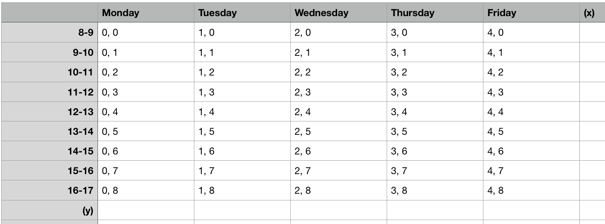

# Stage 1

## Problem Analysis (1)
   - Timetable analysis(1.1):
      - Analyze by looking at a real example:
      - 
      - Define **class**: class is one inctance in any part of the course. 
      In another word, for a lab, a tutorial, or lecture, they can all be  classes.
      - **Assumption**: there are no classes on weekends.
      - A class usually lasts for 50 minutes and starts from 30 minutes after a certain clock.
      - Note: Some classes in the evening may not apply the pattern.
      - Therefore, the timetable can be viewed as an x-y coordinnate.
      - 
      - Note: n-m means from n:30 to m:20
      - For the class in the evening, it can be represented as 
         - Monday[19:20-20:30, 20:30-21:20, 12:30-22:20, -1]
         - Note there is a "-1" at the end of the array. It is a flag which indicates all items in the array should be move backwards for 30 minutes.
   - Structure of a course in McMaster Univeristy(1.2):
      - Three parts:
         - Lecture
         - Tutorial
         - Lab
      - For each part stated above, there may be more than one sections. 
      - Only one of the sections needs to be scheduled into the timetable.
      - Here is a picture of course structure
   - things that are unsure(1.3):
      - Not sure whether there are conflicts between two sections from two different sections.
   - END OF 1
---------
## Choice of data structrue(2):
   - class: ADT-Point
   - section: SET
   - part: array of sections
   - course: ADT-Course containing three parts