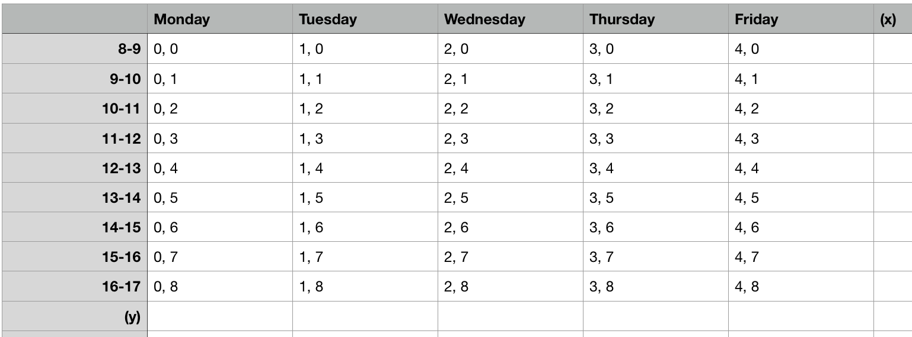

# Schedule Generator for McMaster University 
## Introduction:
This is a program that helps users create timetable when they are in the stage of choosing different sections of different courses before a semester begins. Specifically, this program only works for those organizations having the same course structure as McMaster university's.

   - **Task**: 
      - big view: given courses, return all possible timetables  
   - choice of language: 
      - **Python3**

## Problem Analysis
   - Timetable analysis:
      - Analyze by looking at a real example:
      - 
      - Define **class**: class is one instance from any part of the course, i.e. a **class** can be a lecture, a tutorial, or a lab.
      - **Assumption**: there are no classes on weekends.
      - A class usually lasts for 50 minutes and starts from 30 minutes after a certain clock.
      - Note: Some classes in the evening may not apply the pattern.
      - Therefore, the timetable can be viewed as an x-y coordinnate.
      - 
      - Note: n-m means from n:30 to m:20
   - Structure of a course in McMaster Univeristy:
      - Three parts:
         - Lecture
         - Tutorial
         - Lab
      - For each part stated above, there may be more than one sections. 
      - Only one of the sections needs to be scheduled into the timetable.
      - Here is a picture of course structure
   - things that are unsure:
      - Not sure whether there are conflicts between two sections from two different parts.
---------
## Choice of data structrue
   - class: ADT-Point
   - section: SET
   - part: array of sections
   - course: ADT-Course containing three parts
---------
## Usage
#### Method 1 (Linux or Mac):
   - use **Python3** to run main.py.
   - in your terminal, execute the following commands:
   ```bash
   > git clone https://github.com/Darin1123/Schedule_Generator
   > cd Schedule_Generator/src
   > python3 main.py
   ```
   - follow the instructions to create your schedules.
#### Method 2 (Linux or Mac):
   - download the file **_Schedule_Generator_** and execute the file.
   - follow the instructions to create your schedules.
#### Method 3 (Windows):
   - download the file **_Schedule_Generator.exe_** and execute the file.
   - follow the instructions to create your schedules.
## Output
   - a **.txt** file containing the user input
   - a folder named **Schedules** with some **.csv** files which are all possible schedules
